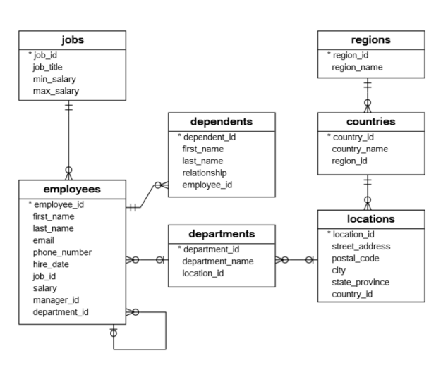
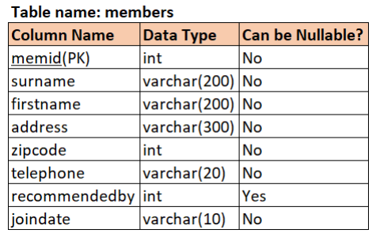

# Challenge Yourself - Oracle

## DBMS_ORACLE_EXERCISE_DDL_COMMANDS

### Question 1 :

From the HR database schema given below, write a query to create a table dependents.

*(Follow the same table names/column names as given.)*

> Note:
> 
>> While creating a department table, define a foreign key relation as given in the schema diagram.
>>
>> Use the data types as given below:

```sql
dependent_id(int),
first_name(varchar(50)), 
last_name(varchar(50)),
relationship(varchar(25)), 
employee_id(int)
```

<div align="center">
    
    <br />
</div>

> ***The required employees table is already created and the values are inserted in the backend.***

##### Expected Input / Output:

```
Input format

    No console input.


Output format

    The output prints the description of the dependents table with the below header.
    Name Null? Type


Sample testcases:-

Input 1:             Output 1:

                Table DEPENDENTS created.

                Name                  Null?             Type
                _______________ ___________ _______________
                DEPENDENT_ID    NOT NULL    NUMBER(38)
                FIRST_NAME      NOT NULL    VARCHAR2(50)
                LAST_NAME       NOT NULL    VARCHAR2(50)
                RELATIONSHIP    NOT NULL    VARCHAR2(25)
```

### Question 2 :

From the table schema given below, write a query to create a table city.

*(Follow the same table names/column names as given along with the case)*

**The country table is already created with the primary key as id.**

> Note:
> 
>> In the city table, id is the Primary key and country_id is the Foreign Key referencing id of the country table.

While creating the city table,
- id is the Primary Key
- define the foreign key relation between 2 tables.

<div align="center">
    
    <br />
</div>

##### Expected Input / Output:

```
Input format

    No console input.


Output format

    The output prints the description of the city table with the below header.
    Name Null? Type


Sample testcases :-

Input 1:             Output 1:

                        Table CITY created.

                        Name        Null?           Type
                _____________ ___________ ______________
                ID            NOT NULL    NUMBER(38)
                CITY_NAME                 CHAR(128)
                LAT                       NUMBER(9,6)
                LON                       NUMBER(9,6)
                COUNTRY_ID                NUMBER(38)
```

### Question 3 :

From the DDL given below,

Write a query to change the column name zipcode to pincode in the members table.

<div align="center">
    
    <br />
</div>

> The table is created in the backend.

```
Input format

    No console input.
Output format

    The output prints the status.
    Refer sample output.


Sample testcases:-

Input 1             Output 1

    N/A          Table MEMBERS altered.
```