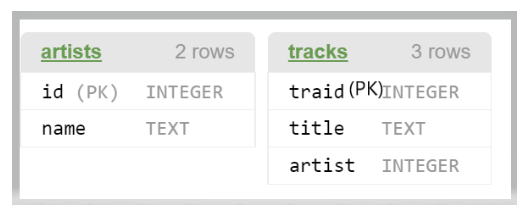

# Skill Builder - Oracle

## DBMS_ORACLE_EXERCISE_DDL_COMMANDS

### Question 1 :

From the DDL given below,

Write a query to create  a table `"members"` and print its description.

***Hint:** Refer to the table for the field names and the data type of the table* 

<div align="center">
    
</div>

- **Note**:
    1. Make sure to apply `NOT NULL` and `Primary Key` (PK) conditions for the columns where ever applicable.
    2. While creatin a table, table name and column name should be exactly the same as given in DDL (including upper/lower case)

##### Expected Input / Output:

```
Input format
No console input.

Table MEMBERS created.


            Name       Null?             Type
________________ ___________ ________________
MEMID            NOT NULL    NUMBER(38)      
SURNAME          NOT NULL    VARCHAR2(200)    
FIRSTNAME        NOT NULL    VARCHAR2(200)    
ADDRESS          NOT NULL    VARCHAR2(300)    
ZIPCODE          NOT NULL    NUMBER(38)      
TELEPHONE        NOT NULL    VARCHAR2(20)    
RECOMMENDEDBY                NUMBER(38)      
JOINDATE         NOT NULL    VARCHAR2(10)
```

---

### Question 2 :

Write a query to change the data type of the column `recommendedby` in the table '`members`' to `varchar(20)`.

Refer to the existing table DLL below.

Existing Table DDL:

<div align="center">
    
</div>

> **The required table is created in the backend.**

##### Expected Input / Output:

```
Input format
No console input.

Output format

Table MEMBERS altered.


            Name       Null?             Type 
________________ ___________ ________________ 
MEMID            NOT NULL    NUMBER(38)       
SURNAME          NOT NULL    VARCHAR2(200)    
FIRSTNAME        NOT NULL    VARCHAR2(200)    
ADDRESS          NOT NULL    VARCHAR2(300)    
ZIPCODE          NOT NULL    NUMBER(38)       
TELEPHONE        NOT NULL    VARCHAR2(20)     
RECOMMENDEDBY                VARCHAR2(20)     
JOINDATE         NOT NULL    VARCHAR2(10)  
```

---

### Question 3 :

Write a query to drop the table `facilities`

> The required tables are populated in the backend.

##### Expected Input / Output:

```
Input format
No console input

Output format
The output prints the status.

Refer sample output.

Sample testcases
Input 1
Output 1

Table FACILITIES dropped.
```

---

### Question 4 :

Write a query to `rename` the table members to '`members_details`'

> The required input tables are created in the back end.

##### Expected Input / Output:

```
Input format
No console input.

Output format
The output prints the status.

Refer sample output.

Sample testcases
Input 1
Output 1

Table MEMBERS altered.
```

---

### Question 5 :

From the table schema given below, write a query to create table tracks.

*(Follow the same table names/column names as given along with the case)*

The artists table is **already created** with the `primary key` as id.

> **Note**:
>
>> In tracks table, traid is the Primary key and artist is the Foreign Key referencing id of artists table.

- While creating a tracks table,
  - traid is the `Primary Key`
  - define the `foreign key` relation between 2 tables.
  - define all the columns with `NOT NULL` condition

<div align="center">
    
</div>

##### Expected Input / Output:

```
Input format
No console input.

Output format
The output prints the description of the tracks table.

Sample testcases
Input 1
Output 1

Table TRACKS created.


     Name       Null?            Type 
_________ ___________ _______________ 
TRAID     NOT NULL    NUMBER(38)      
TITLE     NOT NULL    VARCHAR2(25)    
ARTIST    NOT NULL    NUMBER(38)     
```