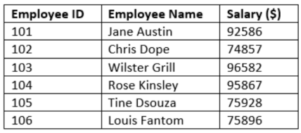
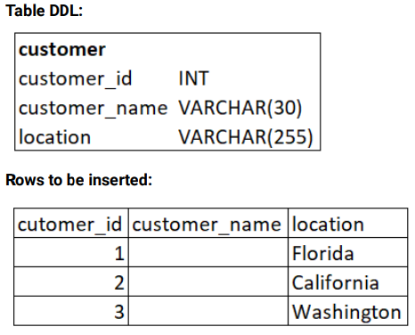

# Skill Builder - Oracle

## DBMS_ORACLE_EXERCISE_DML_COMMANDS

### Question 1 :

The following table consists of names of employees and their salaries at ABC Company.

Consider table name as **employee_details**

<div align="center">
    
</div>

With the sample values given above, Insert values into the employee_details table with the appropriate data type.

Consider column names as **employee_id**, **employee_name**, **salary**.

> **The required table is created in the backend.**

```
Input format

    No console input.


Output format

    The output prints the employee_details table.
    The output should have the below header
    EMPLOYEE_ID EMPLOYEE_NAME SALARY


Sample testcases:

Input 1                         Output 1

                                1 row inserted.

                                1 row inserted.

                                1 row inserted.

                                1 row inserted.

                                1 row inserted.

                                1 row inserted.

                                EMPLOYEE_ID              EMPLOYEE_NAME    SALARY
                                ______________ _______________________ _________
                                        101             Jane Austin     92586
                                        102              Chris Dope     74857
                                        103           Wilster Grill     96582
                                        104            Rose Kinsley     95867
                                        105             Tine Dsouza     75928
                                        106            Louis Fantom     75896

                                6 rows selected.

```

### Question 2 :

Write a query to insert any 5 records to the table 'Products'

The column names and data types are given below.

Table Name: `Products`

Column Names:

```sql
product_id INT PRIMARY KEY,
product_name VARCHAR (255) NOT NULL,
brand_id INT NOT NULL,
category_id INT NOT NULL,
model_year SMALLINT NOT NULL,
list_price DECIMAL (10, 2) NOT NULL
```

> Note:
> 
>> Table names are case-sensitive.
>>
>> **Products table is already created in the backend.**

```
Input format

    No console input.

Output format

    The output prints the number of rows inserted.


Sample testcases:

Input 1                         Output 1

                                1 row inserted.

                                1 row inserted.

                                1 row inserted.

                                1 row inserted.

                                1 row inserted.

                                COUNT(*)

                                ___________

                                5

                                1 row selected.
```

### Question 3 :

Write a query to delete a row from the '`Customers`' table for customer id `304`.

The column names and data types are given below.

**Table Details:**

Table name: `Customers`

Column Names:

```sql
customer_id INT PRIMARY KEY,
first_name VARCHAR (255) NOT NULL,
last_name VARCHAR (255) NOT NULL,
phone VARCHAR (25),
email VARCHAR (255) NOT NULL,
street VARCHAR (255),
city VARCHAR (50),
state VARCHAR (25),
zip_code VARCHAR (5)
```

> Note:
>
>> Table names are case-sensitive.
>>
>> customer_id is from 301 to 307.
>>
>> Insert any 7 records into the table.
>>
>> **Customers table is already created in the backend.**

```
Input format

    No console input.

Output format

    The output prints the remaining customer ids.
    Header: CUSTOMER_ID


Sample testcases:

Input 1                         Output 1

                                1 row inserted.

                                1 row inserted.

                                1 row inserted.

                                1 row inserted.

                                1 row inserted.

                                1 row inserted.

                                1 row inserted.

                                1 row deleted.

                                CUSTOMER_ID
                                ______________
                                            301
                                            302
                                            303
                                            305
                                            306
                                            307

                                6 rows selected.

```

### Question 4 :

Write a query to `update` First Name as 'John' and Last Name as 'Cameroon' for Job ID 'PRES'.

**Table details are as follows:**

Table Name: Employees (Table names are case sensitive)

Column Names (along with data types)

```sql
employee_id - INT Primary key,
first_name - VARCHAR(30), last_name - VARCHAR(30),
email - VARCHAR(30), phone_number - VARCHAR(20),
hire_date - varchar(25),
job_id - VARCHAR(10),
salary - DECIMAL(18,2),
manager_id - INT,
department_id - INT
```

> **The table is created and the values are inserted in the backend.**

```
Input format

    No console input.

Output format

    The output prints the status and the updated data.
    EMPLOYEE_ID FIRST_NAME LAST_NAME EMAIL PHONE_NUMBER HIRE_DATE JOB_ID SALARY MANAGER_ID DEPARTMENT_ID


Sample testcases:

Input 1                         Output 1

                                1 row updated.

                                EMPLOYEE_ID       FIRST_NAME    LAST_NAME         EMAIL    PHONE_N
                                ______________ _____________ ____________ _____________ __________
                                100            John          Cameroon     davesebolt    515.123.45

                                1 row selected.
```

### Question 5 :

#### CREATE TABLE WITHOUT INTEGRITY CONSTRAINTS - NOT NULL

Integrity constraint is used to maintain the quality of information. It is used to ensure the accuracy and consistency of data.

In this exercise, create a table without integrity constraints and add sample rows to understand the importance of integrity
constraints.

Write a SQL statement to create a simple table customer_details with the following DDL without specifying any integrity constraints. 

Insert the following rows into the table.

<div align="center">
    
</div>

> For the blank spaces, it should be populated as a NULL value

****Inference****

From the above question, we understood that,

If a table is created without including integrity constraints like NOT NULL, there will be a possibility of NULL values in the column
where we do not want to have null values.

In the above table, the customer name is the important field that should have the proper value. 

But we can able to insert rows without proper values in the customer name column if we do not specify NOT NULL constraints while creating a table.

> **The customer table is created in the backend.**

```
Output format

    The output should have the below header
    CUSTOMER_ID CUSTOMER_NAME LOCATION

Sample testcases:

Input 1                         Output 1

                                1 row inserted.

                                1 row inserted.

                                1 row inserted.

                                CUSTOMER_ID    CUSTOMER_NAME      LOCATION
                                ______________ ________________ _____________
                                            1                  Florida
                                            2                  California
                                            3                  Washington
                                            3                  rows selected.

                                3 rows selected.
```