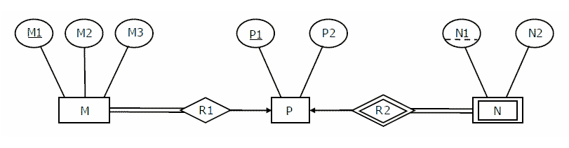

# Concept_Builder

## DBMS_MCQ TEST_INTRODUCTION AND ER DIAGRAM

### Question 1 :

What does the abbreviation DBMS stand for?

- [ ] Digital Base Mapping System
- [ ] Data Borrowing and Movement Software
- [x] Database Management System
- [ ] Database Manipulation Software

---

### Question 2 :

What is a ‘tuple’?

- [x] A row or record in a database table
- [ ] Another name for the key linking different tables in a database.
- [ ] An attribute attached to a record
- [ ] Another name for a table in an RDBMS

---

### Question 3:

Redundancy is minimised with a database approach.

- [x] True
- [ ] False

---

### Question 4 :

If any changes are done in the memory size of the database server then this will not reflect the logical structure of the database is defined as _____________________

- [ ] logical dependency
- [ ] logical data derrivation
- [ ] logical data independence
- [x] physical data independence

---

### Question 5 :

A row in a database can also be called a domain.

- [ ] True
- [x] False

---

### Question 6 :

In an E-R diagram attributes are represented by

- [ ] rectangle
- [ ] square
- [x] ellipse
- [ ] triangle

---

### Question 7 :

For each attribute of a relation, there is a set of permitted values, called the _______ of the attribute

- [x] Domain
- [ ] Relation
- [ ] Set
- [ ] Schema

---

### Question 8 :

The property possessed by each entity set is

- [ ] Entity
- [x] Attribute
- [ ] Relation
- [ ] Model

---

### Question 9 :

The attribute name could be structured as an attribute consisting of first name, middle initial, and last name. This type of attribute is called

- [ ] Simple attribute
- [x] Composite attribute
- [ ] Multivalued attribute
- [ ] Composite attribute

---

### Question 10 :

The attribute AGE is calculated from DATE_OF_BIRTH. The attribute AGE is

- [ ] Single valued
- [ ] Multi valued
- [ ] Composite
- [x] Derived

---

### Question 11 :

In ER Diagram, a relationship between two entities of similar entity type is called a

- [x] Recursive
- [ ] Binary
- [ ] n-ary
- [ ] quadrapole

---

### Question 12 :

In E-R diagram, The Rectangle represents

- [x] Entity set
- [ ] Relationship set
- [ ] Attributes of a relationship set
- [ ] Primary key

---

### Question 13 :

weak entity set is represented in E-R diagram with ____________

- [x] double rectangles
- [ ] double ellipses
- [ ] double lines
- [ ] none of the above

---

### Question 14 :

an attribute that uniquely identifies the record is defined as

- [ ] multi-valued attribut
- [x] key attribute
- [ ] descriptive attribute
- [ ] derrived attribute

---

### Question 15 :

If a Relationship participates in another relationship then it is called as

- [ ] specialization
- [x] aggregation
- [ ] generalization
- [ ] None of the listed options

---

### Question 16 :

which of the following represents conceptual data model?

- [ ] relational model
- [x] E-R model
- [ ] object oriented data model
- [ ] integrated model

---

### Question 17 :

The ER Model includes additional concepts like :

- [ ] Specialization
- [ ] Generalization
- [ ] Aggregation
- [x] All of the listed options

---

### Question 18 :

All of the listed options

- [ ] entity-representation model
- [ ] entity-relation model
- [x] entity-relationship model
- [ ] None of the listed options

---

### Question 19 :

The number of entities to which another entity can be associated via a relationship set is expressed as :

- [ ] Entity
- [x] Cardinality
- [ ] Schema
- [ ] Attributes

---

### Question 20 :

In an E-R model, Oval represents

- [ ] entity sets
- [x] attributes
- [ ] relationships
- [ ] links

---

### Question 21 :

In an E-R modelling, which symbol is used to set up relationships between two or more entities ?

- [ ] Oval
- [ ] Eclipse
- [x] Diamond
- [ ] Rectangle

---

### Question 22 :

In an E-R Diagram, generalization is represented by

- [ ] Eclipse
- [ ] Dashed Eclipse
- [ ] Rectangle
- [x] Triangle

---

### Question 23 :

Given the basic ER and relational model which of the following is incorrect ?

- [ ] An entity can have more than one attribute.
- [ ] An attribute of an entity can be composite.
- [x] In row of a relational table, an attribute have more than one value.
- [ ] In row of a relational table, an attribute can have exactly one value or a NULL value.

---

### Question 24 :

Entities can be associated with one another in which of the following ?

- [ ] Entities
- [ ] Attribute
- [ ] Identifiers
- [x] Relationships

---

### Question 25 :

which of the following is a rdbms ?

- [ ] Windows 11
- [x] SQL Server
- [ ] Rational Rose
- [ ] MS excel

---

### Question 26 :

Consider the following ER diagram:

    
     

The minimum number of tables needed to represent M, N, R1, R2 are

- [ ] 2
- [x] 3
- [ ] 4
- [ ] 5

---

### Question 27 :

We indicate roles in E-R diagram by labelling the lines that connedct ____________ to ____________

- [ ] Diamond, diamond
- [ ] Rectangle, ellipse
- [ ] Rectangle, rectangle
- [x] Diamond, rectangle

---

### Question 28 :

Consider the a directed line(->) from the relationship set advisor to both entity sets instructor and student. This indicates ____________

- [ ] One to many
- [x] One to one
- [ ] Many to many
- [ ] Many to one

---

### Question 29 :

____________is defined as the function of an entity which it plays in relationship set

- [ ] Relation
- [x] role
- [ ] aggregation
- [ ] generalization

---

### Question 30 :

The overall design of the database is called as____

- [ ] data independence
- [x] database schema
- [ ] database Instance
- [ ] data redundancy

---