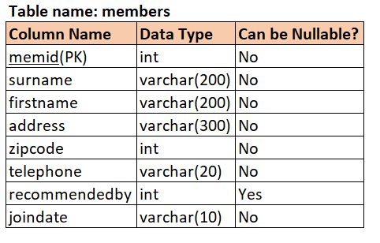

# DDL Commands (Week - 1)
---
## DBMS_ORACLE_EXERCISE_DDL_COMMANDS

---

### Question 1 :

From the DDL given below,
Write a query to create  a table "members" and print its description.
Hint: Refer to the table for the field names and the data type of the table 

<div align="center">
    <a href="src/Q1.png" target="_blank" title="View image" >
        
    </a>
</div>

Note:
    1. Make sure to apply NOT NULL and Primary Key (PK) conditions for the columns where ever applicable.
    2. While creatin a table, table name and column name should be exactly the same as given in DDL (including upper/lower case)

##### Expected Output:

```
Table MEMBERS created.


            Name       Null?             Type
________________ ___________ ________________
MEMID            NOT NULL    NUMBER(38)      
SURNAME          NOT NULL    VARCHAR2(200)    
FIRSTNAME        NOT NULL    VARCHAR2(200)    
ADDRESS          NOT NULL    VARCHAR2(300)    
ZIPCODE          NOT NULL    NUMBER(38)      
TELEPHONE        NOT NULL    VARCHAR2(20)    
RECOMMENDEDBY                NUMBER(38)      
JOINDATE         NOT NULL    VARCHAR2(10)
```